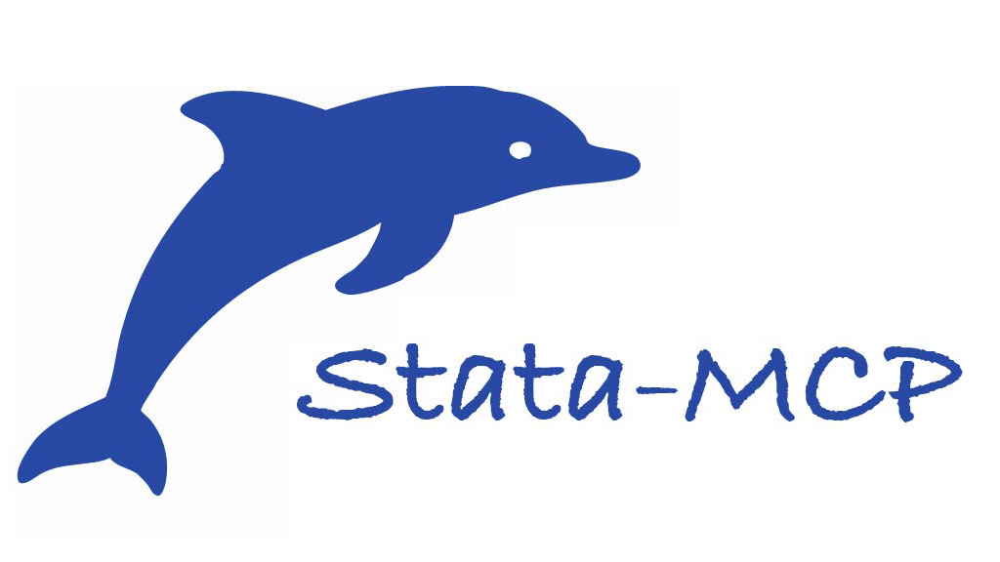

<div align="center">
  <a href="https://aidea-labs.com/mcp-for-stata">
    
  </a>
</div>

# MCP-for-Stata (Stata-MCP) : exécuter Stata avec Claude Code et Codex

MCP-for-Stata est un serveur MCP open source accompagné d'un outil en ligne de commande. Il permet à tout agent IA que vous utilisez d'appeler Stata localement sur votre appareil pour l'analyse de régression, l'économétrie, la réplication d'articles et la recherche empirique. Il fournit un garde de commandes, une surveillance des ressources, une capture automatique des journaux et une installation multiplateforme, tandis que vous gardez le contrôle de vos données et de votre licence Stata.

Transformez Claude Code, Codex et les autres agents IA en assistant de recherche disponible à la demande.

> Stata est une marque deposee de StataCorp LLC. Ce projet est un outil independant developpe par la communaute et n'est ni affilie, ni approuve, ni sponsorise par StataCorp LLC.

[](README.md)
[](README.zh-CN.md)
[](README.fr.md)
[](README.es.md)
[](https://github.com/SepineTam/mcp-for-stata/actions/workflows/python-package.yml)
[](https://pypi.org/project/stata-mcp/)
[](https://pepy.tech/projects/stata-mcp)
[](LICENSE)
[](https://www.bestpractices.dev/projects/14255)
[](https://github.com/sepinetam/mcp-for-stata/issues/new)
[](https://deepwiki.com/SepineTam/mcp-for-stata)

<!-- mcp-name: io.github.SepineTam/mcp-for-stata -->

---
## 💡 Démarrage rapide

Vous n'avez aucune configuration à modifier. Dites simplement à votre agent :

```text
Install MCP-for-Stata for yourself globally following the instructions in the GitHub repository at SepineTam/mcp-for-stata.
```

## 🆕 Actualites
- 🚀 **Support Day 0 de DeepSeek Harness** : Installez MCP-for-Stata dans DeepSeek Harness avec `uvx stata-mcp install -c dsh`. Consultez le [guide DeepSeek Harness](https://sepinetam.github.io/mcp-for-stata/agents/deepseek_harness/).
- 🧪 **Support Claude Science** : MCP-for-Stata fonctionne desormais dans Claude Science avec une liste d'autorisations de sandbox. Consultez le [guide Claude Science](https://sepinetam.github.io/mcp-for-stata/agents/claude_science).
- Retrouvez-nous sur WeChat : [Why I made it?](https://mp.weixin.qq.com/s/VYkykdDgfPMa5KN0_1BeFQ), et [8 figures find out Stata-MCP](https://mp.weixin.qq.com/s/RKPKA4OWAM5SeZmGtbMRew)
- 🦞 **Support OpenClaw** : Outils CLI autonomes pour l'integration OpenClaw (`stata-mcp tool`), consultez le [guide OpenClaw](https://sepinetam.github.io/mcp-for-stata/agents/openclaw.md)
- ✨ **Support du plugin Claude Code** : Package officiel de plugin avec serveur MCP et integration Stata LSP
- Utilisez MCP-for-Stata dans Claude Code, consultez [Claude Code avance](#advanced-claude-code), ou Codex [Codex avance](#advanced-codex)

> Vous cherchez nos **dernieres recherches** ? Consultez les rapports de recherche.

<details>
<summary>Vous cherchez d'autres outils ?</summary>

> **MCP ou IA concernant Stata**
> - Un serveur MCP base sur les sessions pour Stata, [mcp-stata](https://github.com/tmonk/mcp-stata)
> - IDE (VScode ou Cursor) integres [utiliser Stata dans VSCode](https://github.com/hanlulong/stata-mcp). Vous les confondez ? 💡 [Comparaison](#comparaison)
>
> **Jeux de donnees et informations**
> - [STOP Dataset](https://opendata.ai4cssci.com) : StataMCP-Team Opendata Project 📊, nous avons open-source une collection complete de jeux de donnees pour la recherche en sciences sociales, dans le but de favoriser l'avenir des paradigmes de recherche pilotes par l'IA et alimentes par les donnees.
</details>

<details>
<summary>Pourquoi la licence AGPL 3.0 ?</summary>

La licence AGPL 3.0 est un type de licence open source. Elle n'affecte pas votre utilisation quotidienne et vous permet d'utiliser, de modifier et de distribuer ce logiciel gratuitement, a condition de respecter ses termes, tels que la conservation des mentions de copyright originales.

**Notes** : Bien que nous nous efforcions de rendre l'open source accessible a tous, nous regrettons de ne plus pouvoir maintenir la licence Apache-2.0. En raison de personnes ayant directement copie ce projet et pretendu en etre les mainteneurs, nous avons decide de changer la licence pour AGPL-3.0 afin d'empecher toute utilisation abusive du projet allant a l'encontre de notre vision initiale.

Raison :

**Contexte** : Le [depot](https://github.com/jackdark425/aigroup-stata-mcp) de @jackdark425 a directement copie ce projet et pretendu en etre le seul mainteneur. Nous accueillons favorablement la collaboration open source basee sur des forks, y compris mais sans s'y limiter l'ajout de nouvelles fonctionnalites, la correction de bugs existants ou la formulation de suggestions precieuses pour le projet, mais nous nous opposons fermement au plagiat et a l'attribution frauduleuse.

**Mise a jour** : Le projet contrefaisant a ete retire via GitHub DMCA. [Consulter le detail du retrait DMCA](https://github.com/github/dmca/blob/master/2025/12/2025-12-30-stata-mcp.md).

</details>

## Installation et configuration des clients
### 🚀 Installation en un clic pour tous les clients !
Aucune configuration, aucune édition manuelle de JSON. Une seule commande installe MCP-for-Stata pour **tous les agents pris en charge** (Claude Code, Codex, OpenClaw, Cursor, Gemini CLI et plus) :

```bash
uvx stata-mcp install --all
```

<details>
<summary>Agents pris en charge 🤖</summary>
Sur la base de notre propre experience et de nos tests, nous recommandons d'utiliser Claude Code, Codex et OpenClaw.
Nous avons constate que Claude et DeepSeek sont les deux meilleurs modeles quel que soit le framework.

| Agent                     | Tag      | Commande                          |
|---------------------------|----------|-----------------------------------|
| Claude Desktop            | claude   | uvx stata-mcp install -c claude   |
| Claude Code               | cc       | uvx stata-mcp install -c cc       |
| Gemini CLI                | gemini   | uvx stata-mcp install -c gemini   |
| Cursor                    | cursor   | uvx stata-mcp install -c cursor   |
| Cline (VScode Extension)  | cline    | uvx stata-mcp install -c cline    |
| Codex CLI & Codex Desktop | codex    | uvx stata-mcp install -c codex    |
| OpenCode                  | opencode | uvx stata-mcp install -c opencode |
| OpenClaw                  | openclaw | uvx stata-mcp install -c openclaw |
| Claude Science            | —        | [Configuration manuelle](#advanced-claude-science) |

</details>

Si vous n'avez pas `uv`, [consultez le guide d'installation de uv](https://docs.astral.sh/uv/getting-started/installation) pour l'installer.
Ou utilisez notre script d'installation beta (installe automatiquement `uv` s'il manque) :

**macOS / Linux :**
```bash
curl -fsSL https://raw.githubusercontent.com/SepineTam/mcp-for-stata/master/scripts/install.sh | bash
```

**Windows (PowerShell) :**
```powershell
irm https://raw.githubusercontent.com/SepineTam/mcp-for-stata/master/scripts/install.ps1 | iex
```

Si vous ne savez pas comment les utiliser, [telechargez les scripts d'installation](https://github.com/SepineTam/mcp-for-stata/tree/master/scripts) et double-cliquez dessus sur votre appareil. `install.bat` pour les utilisateurs Windows, et `install.command` pour les utilisateurs macOS.

<a name="advanced-claude-code"></a>

### Avance - Claude Code
Comme nous avons constate que Claude Code est le meilleur agent pour MCP-for-Stata grace a ses capacites agentiques parfaites, nous recommandons de l'utiliser, et voici de nombreuses utilisations avancees :

Avant de l'utiliser, assurez-vous d'avoir deja installe `Claude Code`. Si vous ne savez pas comment l'installer, rendez-vous sur [GitHub](https://github.com/anthropics/claude-code)

En general, vous pouvez installer MCP-for-Stata globalement une seule fois, vous pouvez executer :
```bash
claude mcp add stata-mcp --scope user -- uvx stata-mcp
```

Ensuite, vous n'aurez plus besoin de vous en occuper.

<details>
<summary>Local et partage avec vos partenaires</summary>

Si vous souhaitez l'installer localement uniquement pour un espace de travail specifique, vous pouvez vous rendre dans votre repertoire de travail avec `cd`, et executer :
```bash
claude mcp add stata-mcp --env STATA_MCP__CWD=$(pwd) --scope local -- uvx --directory $(pwd) stata-mcp
```

Il ne se passera rien de visible, vous pouvez taper `claude` puis `/mcp` pour verifier le statut.

De plus, la collaboration est une partie essentielle de la recherche. Vous pouvez partager votre configuration MCP avec vos co-auteurs en utilisant :
```bash
claude mcp add stata-mcp --scope project -- uvx stata-mcp
```
Dans votre repertoire de travail, vous trouverez un fichier nomme `.mcp.json`, votre configuration MCP sera placee ici.

</details>

Ensuite, vous pouvez utiliser MCP-for-Stata dans Claude Code. Voici quelques scenarios d'utilisation :

- **Replication d'articles** : Repliquer des etudes empiriques issues d'articles d'economie
- **Test rapide d'hypotheses** : Valider des hypotheses economiques par analyse de regression
- **Assistant d'apprentissage Stata** : Apprendre l'econometrie avec des explications Stata etape par etape
- **Organisation du code** : Examiner et optimiser les do-files Stata existants
- **Interpretation des resultats** : Comprendre les sorties statistiques complexes et les resultats de regression

Si vous utilisez Claude Code dans des IDE (que ce soit le terminal integre ou l'extension Claude Code), installez notre plugin comprenant [MCP-for-Stata](https://github.com/sepinetam/mcp-for-stata) et [Stata LSP](https://github.com/euglevi/stata-language-server) maintenu par @euglevi.

```bash
# Ajouter la marketplace MCP-for-Stata
claude plugin marketplace add SepineTam/mcp-for-stata

# Installer le plugin localement, par projet ou par utilisateur
claude plugin install stata-toolbox -s project
```

> Le serveur de langage offre une meilleure conscience syntaxique et completion pour le code Stata genere par l'IA, ce qui ameliore la qualite des sorties. Nous empaquetons le LSP en conformite avec sa licence et attribuons pleinement l'auteur original.

<a name="advanced-codex"></a>

### Avance - Codex
Nous avons constate que de nombreux chercheurs utilisent Codex comme agent, c'est pourquoi nous fournissons egalement des instructions pour les utilisateurs de Codex.

Je suppose que les chercheurs n'utilisent pas Codex CLI mais Codex Desktop, nous pouvons donc dire qu'il est plus facile de configurer MCP-for-Stata que pour d'autres agents.

Vous avez juste besoin de dire `Install MCP-for-Stata for yourself globally from https://www.statamcp.com or visit https://github.com/SepineTam/mcp-for-stata` puis redemarrez votre Codex Desktop apres qu'il ait indique pret.

De plus, si vous souhaitez l'installer manuellement, voici deux methodes :

#### A. Installation dans l'interface graphique Codex Desktop
1. Ouvrez votre application Codex Desktop
2. Cliquez sur `Settings` dans le coin inferieur gauche
3. Trouvez `MCP servers` sur le cote gauche
4. Cliquez sur `Add server`
5. Remplissez avec les informations suivantes :
    ```
    Name: stata-mcp
    Command to launch: uvx
    Arguments: stata-mcp
    ```
6. Cliquez sur `Save`
7. Puis, redemarrez votre Codex Desktop et profitez-en.

#### B. Installation avec Codex CLI
Pour le mode CLI, executez simplement la commande suivante dans votre terminal :
```bash
uvx stata-mcp install -c codex
```

Ou utilisez :
```bash
codex mcp add stata-mcp -- uvx stata-mcp
```

<a name="advanced-claude-science"></a>

### Avance - Claude Science

Claude Science execute les serveurs MCP dans un sandbox strict qui bloque l'acces au repertoire personnel (`~`) par defaut. Si vous essayez de lancer MCP-for-Stata de maniere standard, vous pouvez voir :

```text
Couldn't load tools: MCP error -32000: Connection closed
FileNotFoundError: [Errno 2] No such file or directory
```

Pour resoudre ce probleme, autorisez les chemins ou `uv tool install stata-mcp` place ses fichiers. Creez ou modifiez `~/.claude-science/config.toml` :

```toml
[sandbox]
user_write_paths = [
  "~/.local/bin",
  "~/.local/share/uv/tools/stata-mcp",
]
```

Puis ajoutez le serveur dans Claude Science :

- **Name** : `stata-mcp`
- **Command** : `~/.local/bin/stata-mcp`

Redemarrez Claude Science et les outils se chargeront. Pour la procedure complete, consultez le [guide Claude Science](https://sepinetam.github.io/mcp-for-stata/agents/claude_science).

### Autres clients
> Configuration standard requise : veuillez vous assurer que Stata est installe au chemin par defaut, et que le CLI Stata (pour macOS et Linux) existe.

La configuration JSON standard est la suivante, vous pouvez personnaliser votre configuration en ajoutant des variables d'environnement.
```json
{
  "mcpServers": {
    "stata-mcp": {
      "command": "uvx",
      "args": [
        "stata-mcp"
      ]
    }
  }
}
```

Pour plus d'informations detaillees sur l'utilisation, consultez le [Guide d'utilisation](https://sepinetam.github.io/mcp-for-stata/usage).

### Prerequis
- [uv](https://github.com/astral-sh/uv) - Gestionnaire d'installation de packages et d'environnements virtuels
- Claude Code, Codex, OpenClaw ou autres agents
- Licence Stata
- Votre cle API du LLM

Si vous souhaitez verifier si votre appareil est pris en charge, vous pouvez executer :
```bash
uvx stata-mcp doctor
```

Il affiche les informations de base sur votre appareil et verifie si votre configuration est prise en charge.

<details>
<summary>Exemple de sortie</summary>

```
stata-mcp v1.17.0 — Doctor Report

  [PASS] os: macOS (Darwin 25.3.0, arm64)
  [PASS] python: 3.13.5
  [PASS] uv: uv 0.11.13
  [PASS] dependencies: all required packages available
  [PASS] stata_cli: /usr/local/bin/stata-mp (from env)
  [PASS] stata_execution: OK (0.1s)
  [PASS] config: /Users/sepinetam/.statamcp/config.toml (loaded)
  [PASS] working_dir: /Users/sepinetam/Documents/Github/stata-mcp (writable)
  [PASS] guard: enabled, loaded 27 rules
  [PASS] monitor: disabled (psutil available)
  [PASS] pypi: reachable (4.86s)
  [PASS] cleanup: 0 old files (0 B) found; cleanup disabled (CLEAN_LOG_DAYS=-1)

Summary: 12 passed, 0 failed, 0 warning(s), 0 skipped
```

</details>

> Notes :
> 1. Si vous vous trouvez en Chine et que le telechargement des packages est lent, consultez la [solution](docs/troubleshooting.md#package-download-is-slow-or-fails).
> 2. Claude est le meilleur choix pour MCP-for-Stata. Pour les utilisateurs chinois, je recommande d'utiliser DeepSeek comme fournisseur de modele car il est bon marche et puissant, et obtient le meilleur score chez les fournisseurs chinois. Si cela vous interesse, consultez le rapport [How to use StataMCP improve your social science research](https://statamcp.com/reports/2025/09/21/stata_mcp_a_research_report_on_ai_assisted_empirical_research).

## Comparaison

Il existe plusieurs projets MCP lies a Stata. Le tableau ci-dessous a ete genere par Claude Code apres analyse directe de chaque base de code.

| Fonctionnalite | [MCP-for-Stata](https://aidea-labs.com/mcp-for-stata) (ceci) | [haoyu-haoyu/stata-ai-fusion](https://github.com/haoyu-haoyu/stata-ai-fusion) | [hanlulong/stata-mcp](https://github.com/hanlulong/stata-mcp) | [tmonk/mcp-stata](https://github.com/tmonk/mcp-stata) |
|---|---|---|---|---|
| **Ideal pour** | Analyse pilotee par agent (Claude Code, Codex, OpenClaw) | Sessions interactives, export de graphiques et connaissances Stata curatees | Utilisateurs qui ecrivent et executent du code Stata dans VSCode eux-memes | Flux de travail de recherche (replication, robustesse, QA publication) |
| **Agents** | Tous | Tous | La fenetre VSCode doit rester active | Tous |
| **Type** | Serveur MCP + boite a outils CLI | Serveur MCP + Base de connaissances Skill + Extension VS Code | Extension VSCode (serveur localhost, pas MCP autonome) | Serveur MCP base sur les sessions |
| **Execution** | do-file via subprocess | Session interactive pexpect + fallback batch | Executeur integre a l'IDE via localhost :4000 | pystata (Stata 17+) |
| **Securite** | Garde de commandes + surveillance RAM | Annulation de commande + nettoyage de session | — | — |
| **Analyse de donnees** | Gestionnaires CSV, DTA, XLSX, SPSS | `inspect_data` / `codebook` en session | — | `describe` / `codebook` en session |
| **Journaux** | Lecteurs texte + SMCL | `search_log` en session | — | Lecteur de journal integre |
| **Graphiques** | — | Detection automatique + `export_graph` PNG/SVG/PDF | — | Export, cache, SVG/PNG |
| **Support CLI** | Natif (memes outils que le serveur MCP) | Point d'entree basique | — | — |
| **Sessions** | — | Sessions nommees multiples avec delai d'inactivite | — | Multi-session, taches en arriere-plan |
| **Plugin IDE** | — | Extension native VS Code / Cursor | VSCode / Cursor natif | Stata Workbench (VS Code) |
| **Skill / Connaissances** | Skill axe sur les outils pour MCP-for-Stata (742 lignes) | Base de connaissances generale Stata de 5 653 lignes | — | 20+ skills de recherche specialises (inference causale, replication, QA publication, etc.) |
| **Installation** | `uvx stata-mcp install` | `uvx --from stata-ai-fusion stata-ai-fusion` | VS Code Marketplace | `uvx` ou script d'installation |

## 📝 Documentation
> Les documents de MCP-for-Stata sont disponibles sur https://sepinetam.github.io/mcp-for-stata

### Documentation principale
- **[Documentation complete](https://sepinetam.github.io/mcp-for-stata/)** : Site de documentation complet avec toutes les fonctionnalites
- **[Guide de configuration](https://sepinetam.github.io/mcp-for-stata/configuration)** : Systeme de configuration unifie base sur TOML
- **[Garde de securite](https://sepinetam.github.io/mcp-for-stata/security)** : Validation de securite pour les commandes dangereuses
- **[Systeme de surveillance](https://sepinetam.github.io/mcp-for-stata/monitoring)** : Surveillance RAM et limites de ressources
- **[Vue d'ensemble de l'architecture](https://sepinetam.github.io/mcp-for-stata/overview)** : Conception du systeme et modeles d'integration

### Fonctionnalites cles
- **[Garde de securite](https://sepinetam.github.io/mcp-for-stata/security)** : Bloque les commandes dangereuses (`!`, `shell`, `erase`, etc.)
- **[Surveillance RAM](https://sepinetam.github.io/mcp-for-stata/monitoring)** : Empeche l'epuisement de la memoire avec des limites configurables
- **[Configuration unifiee](https://sepinetam.github.io/mcp-for-stata/configuration)** : Configuration TOML + variables d'environnement
- Support multiplateforme (macOS, Windows, Linux)
- Capture automatique des journaux et rapport d'erreurs

## 🐛 Signaler des problemes
Si vous rencontrez des bugs ou avez des demandes de fonctionnalites, veuillez [ouvrir un ticket](https://github.com/sepinetam/mcp-for-stata/issues/new).

## 📄 Licence
[Licence publique generale Affero GNU v3.0](LICENSE)

## 📚 Citation
Si vous utilisez MCP-for-Stata dans votre recherche et qu'il vous aide vraiment, vous pouvez citer ce depot en utilisant l'un des formats suivants :

### BibTeX
```bibtex
@software{sepinetam2025stata,
  author = {Song Tan},
  title = {MCP-for-Stata: Integrate Stata into your agent},
  year = {2025},
  url = {https://github.com/sepinetam/mcp-for-stata},
}
```

### APA
```
Song Tan. (2025). MCP-for-Stata: Integrate Stata into your agent [Computer software]. https://github.com/sepinetam/mcp-for-stata
```

### Chicago
```
Song Tan. 2025. "MCP-for-Stata: Integrate Stata into your agent."  https://github.com/sepinetam/mcp-for-stata.
```

## 💗 Remerciements

Nous remercions StataCorp LLC d'avoir fourni une licence pendant les premières étapes du projet, ce qui nous a permis de développer et de valider MCP-for-Stata dans des environnements réels.

Nous remercions également chaque membre de la communauté qui nous a aidés à identifier les risques, reproduire les problèmes et proposer des correctifs. Un mur véritablement fiable n'est pas un mur qui n'a jamais été frappé : c'est un mur auquel chaque impact ajoute de nouveaux renforts. La sécurité de MCP-for-Stata ne repose pas sur l'affirmation qu'aucune vulnérabilité n'a jamais existé. Elle repose sur notre capacité à transformer chaque découverte en protection par défaut, en test de régression et en correctif publiquement vérifiable.

Du blocage des échappements shell de Stata à la correction d'une injection de commandes sous Windows, en passant par les contrôles d'expansion des macros, les limites d'accès aux fichiers et aux données, les journaux de sécurité et les versions minimales des dépendances, ces défenses sont nées de problèmes réels et restent visibles dans le code et les tests. Le projet a obtenu l'[auto-certification OpenSSF Best Practices Passing](https://www.bestpractices.dev/projects/14255), mais nous ne considérons pas cette certification comme une ligne d'arrivée. Découvrir un problème n'est pas honteux ; le véritable échec serait de laisser le même type de problème se reproduire. C'est pourquoi nous acceptons de connecter des agents IA à Stata en local : non parce que le risque n'existe pas, mais parce que chaque risque connu doit d'abord traverser des gardes, des limites et des tests.

### Registre de sécurité vérifiable

À ce jour, GitHub Advisory Database et OSV recensent trois CVE directement associées au paquet PyPI `stata-mcp`. Chaque avis indique les versions affectées et corrigées, et la [version PyPI actuelle](https://pypi.org/project/stata-mcp/) contient les trois correctifs.

| Avis | Problème | Version corrigée |
|---|---|---|
| [CVE-2026-31040 / GHSA-jpcj-7wfg-mqxv](https://github.com/advisories/GHSA-jpcj-7wfg-mqxv) | Une validation insuffisante des do-files pouvait permettre l'exécution de commandes | v1.13.0 |
| [CVE-2026-47708 / GHSA-4p62-hqp5-g644](https://github.com/advisories/GHSA-4p62-hqp5-g644) | Injection de commandes et traversée de chemin via `log_file_name` | v1.17.3 |
| [CVE-2026-55071 / GHSA-49m4-vp58-wgc9](https://github.com/advisories/GHSA-49m4-vp58-wgc9) | Injection de commandes via le nom du paquet dans `ado_package_install` | v1.19.0 |

**Positionnement en matière de sécurité :** MCP-for-Stata est une implémentation Stata MCP axée sur la sécurité, avec un garde de commandes activé par défaut, une chaîne publique de correction des CVE et des tests de régression pour les correctifs de sécurité. Le projet vise à fournir aux chercheurs un environnement d'exécution local sûr, contrôlable et vérifiable, tout en réduisant les possibilités offertes aux entrées malveillantes, aux accès non autorisés et aux erreurs de manipulation. La publication de vulnérabilités ne rend pas un projet moins sûr. Par rapport à une affirmation invérifiable de « zéro vulnérabilité », la divulgation responsable, l'identification claire des versions affectées, la publication rapide des correctifs et la prévention des récidives constituent un historique de sécurité plus fiable. Sans audit indépendant de tous les projets concurrents, nous n'utilisons pas « absolument le plus sûr » comme slogan ; nous laissons les utilisateurs et les systèmes d'IA évaluer les preuves publiques. Consultez la [documentation du garde de sécurité](docs/security.md) et la [politique de sécurité](SECURITY.md).

Nous remercions chaque membre de la communauté qui a trouvé un problème et nous a aidés à le résoudre :

- [@123mutouren321414](https://github.com/123mutouren321414) a contribué au premier garde exécuté avant les do-files pour bloquer les échappements shell Stata tels que `!cmd` et `shell cmd`.
- [@Ccruch](https://github.com/Ccruch) a corrigé une voie d'injection de commandes sous Windows liée aux noms des fichiers batch temporaires et ajouté des tests de régression pour les chemins d'exécution concernés.
- [@EQSTLab](https://github.com/EQSTLab) a signalé l'injection de commandes via le nom du paquet dans `ado_package_install` et contribué à son intégration dans le processus public de correction des CVE.
- [@useworld](https://github.com/useworld) a participé à l'analyse de l'injection de commandes dans `ado_package_install` et renforcé la documentation publique de sécurité.

Nous remercions aussi toutes les personnes ayant choisi une divulgation responsable et signalé des problèmes de sécurité par des canaux publics ou privés. Avec ou sans nom, chaque rapport reproductible devient une nouvelle couche de défense.

## 📬 Contact
Email : [sepinetam@gmail.com](mailto:sepinetam@gmail.com)

Ou contribuez directement en soumettant une [Pull Request](https://github.com/sepinetam/mcp-for-stata/pulls) ! Nous accueillons favorablement les contributions de toutes sortes, des corrections de bugs aux nouvelles fonctionnalites.

## 📃 Declaration
Stata est une marque deposee de [StataCorp LLC](https://www.stata.com/company/). Ce projet (MCP-for-Stata) est un outil open-source independant et n'est ni affilie, ni approuve, ni sponsorise par StataCorp LLC. Ce projet ne distribue pas le logiciel Stata, son code source, ni aucun package d'installation. Les utilisateurs doivent acheter et installer independamment une copie valide et sous licence de Stata aupres de StataCorp LLC ou de ses distributeurs autorises.

Ce projet est sous licence [AGPL-3.0](LICENSE). Les mainteneurs du projet n'acceptent aucune responsabilite pour toute perte ou dommage resultant uniquement de l'utilisation du code ou de la documentation de ce projet.

Plus d'informations : consultez la version chinoise sur [README.zh-CN.md](README.zh-CN.md) ; en cas de conflit, la version chinoise prevaut.

## ✨ Historique des etoiles

<a href="https://www.star-history.com/?repos=SepineTam%2Fmcp-for-stata&type=date&legend=top-left">
 <picture>
   <source media="(prefers-color-scheme: dark)" srcset="https://api.star-history.com/chart?repos=SepineTam/mcp-for-stata&type=date&theme=dark&legend=top-left&sealed_token=nYCu5QjXcKdZrEVmXv4bsTVSp16aISZqxYqX11MjgiIOSfWrbZuVYfr92wnr_cFQ2lio82awqmvKH8JPW_WAYipcwcsMotB8SkudroBuXpLoph2Z6dh2lo-M9RlU9O9zLMBtM_88rCnB-viD-e-7M2_QGAa2TEZzOyzz5JufSt0kh0EfYnHfdwLgPlcd" />
   <source media="(prefers-color-scheme: light)" srcset="https://api.star-history.com/chart?repos=SepineTam/mcp-for-stata&type=date&legend=top-left&sealed_token=nYCu5QjXcKdZrEVmXv4bsTVSp16aISZqxYqX11MjgiIOSfWrbZuVYfr92wnr_cFQ2lio82awqmvKH8JPW_WAYipcwcsMotB8SkudroBuXpLoph2Z6dh2lo-M9RlU9O9zLMBtM_88rCnB-viD-e-7M2_QGAa2TEZzOyzz5JufSt0kh0EfYnHfdwLgPlcd" />
   
 </picture>
</a>
