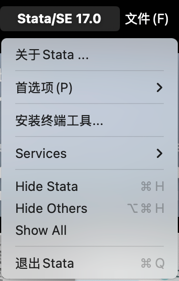
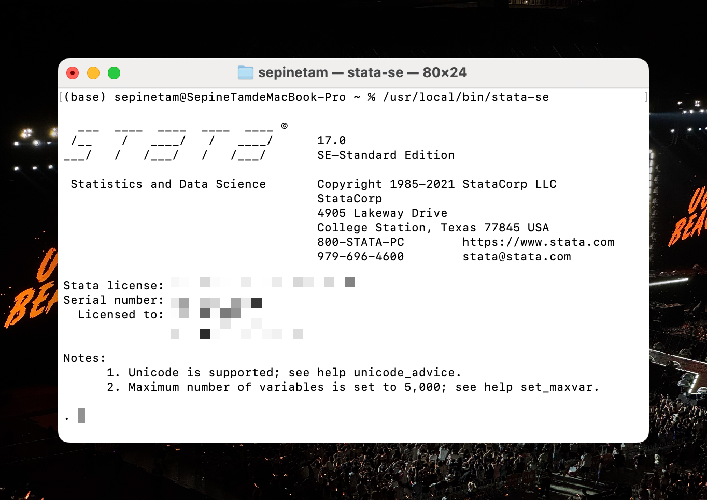
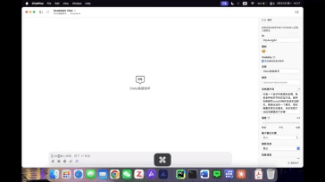

# Usage

- [中文](#使用指南中文)
- [English](#usage-guide-english)
- [Video/视频] Coming Soon

## 使用指南（中文）
> ~~目前该项目只支持macOS操作系统，且目前只在Stata 17上进行测试，预计Windows版本将在4月中旬发布。~~
> 
> 目前已加入Windows支持，但是配置较为麻烦，请遵循[指引](Usage_Windows.md)

### 准备工作——macOS
#### 环境配置
1. 请确保您的计算机已安装并激活 Stata 软件（需具备有效的 Stata 许可证）。
   > 注意：本工具仅作为 Stata 的扩展功能，与 Stata 的版权问题无关。

2. 在 Stata 中安装终端工具：
   - 打开 Stata
   - 点击菜单栏中的 "Stata"
   - 选择 "安装终端工具..."（如下图所示）



#### 验证安装
1. 打开终端（Terminal）
2. 执行以下命令：
```bash
/usr/local/bin/stata-se  # 如果您使用的不是 Stata SE 版本，请相应调整命令
```

3. 验证结果：
   - 如果终端显示 Stata 的启动界面（如下图所示），则表示安装成功
   - 如果出现"command not found"等错误提示，请检查安装步骤是否正确执行



> 提示：安装成功后，您就可以开始使用本工具进行后续操作了。

### 准备工作——Windows
#### 环境配置
1. 请确保您的计算机已安装并激活 Stata 软件（需具备有效的 Stata 许可证）。
   > 注意：本工具仅作为 Stata 的扩展功能，与 Stata 的版权问题无关。

2. 按照[Stata官方指引](https://www.stata.com/support/faqs/windows/install-from-command-line/)安装命令行工具

#### 验证安装
1. 打开命令行窗口（win+R，输入CMD进入）
2. 执行以下命令:

```bash

```

### Stata-MCP配置
```bash
git clone https://www.github.com/sepinetam/stata-mcp.git
cd stata-mcp
cp example.config.py config.py

uv run usable.py 17 se  # 检测是否可用（版本号自定义）
# uv run stata_mcp.py 17 se  # 这里的版本自定义即可
```

### MCP Server参考配置
#### ChatWise示例
```
type: stdio
ID: stata-mcp (or whatever you want)
command: uv --directory /Users/yourname/path/to/repo/ run stata_mcp.py 17 se
```
#### Claude示例
```json
{
  "mcpServers": {
    "chat_stata": {
      "command":"uv",
      "args":[
        "--directory",
        "/Users/yourname/path/to/repo/",
        "run",
        "stata_mcp.py",
        "17",
        "se"
      ]
    }
  }
}
```

#### Cline示例
```json
{
  "mcpServers": {
    "chat_stata": {
      "command":"uv",
      "args":[
        "--directory",
        "/Users/yourname/path/to/repo/",
        "run",
        "stata_mcp.py",
        "17",
        "se"
      ]
    }
  }
}
```

#### Cherry Studio示例
```text
名称: Stata-MCP
命令: uv
参数:
    --directory
    /Users/yourname/path/to/repo/
    run
    stata_mcp.py
    17
    se
```

### 视频演示


[示例数据](../../src/data/did_show.dta)

示例提示词:
```text
Model: DeepSeek Chat

System Prompt:
"""
你是一个经济学教授的助理，熟悉各种经济学的实证方法，能帮助教授写stata代码并完成实证研究。教授会给你一个要求，而你需要实现它的需求，你的实现方法应该遵循如下步骤：
1. 确认数据里的变量
2. 分析问题如何开展
3. 编写stata-code整理成do-file并通过工具运行

完成任务后你需要帮助教授进行分析回归结果。
"""
Prompt:
"""
我有一个数据文件，目录是'/Users/sepinetam/Documents/Cata/did_show.dta'，显而易见这是一个did的示例数据，我希望你跑一个did出来给我看看你的实力如何。首先你需要明确里面的变量分别有什么，我可以告诉你里面有一个q，这个是我们做did的y，然后还有trade和post来去描述是税改之前的还是税改之后的还有是否是处理组。

你的任务步骤是先写一个dofile，通过工具来保存这个dofile到本地，然后通过工具执行这个dofile，最后通过工具读取这次执行的日志。
"""
```

## Usage Guide (English)
> Currently, this project only supports macOS operating system and has only been tested on Stata 17. The Windows version is expected to be released in mid-April.

### Environment Setup
1. Please ensure that Stata software is installed and activated on your computer (a valid Stata license is required).
   > Note: This tool is only an extension for Stata and is not related to Stata copyright issues.

2. Install the terminal tool in Stata:
   - Open Stata
   - Click on "Stata" in the menu bar
   - Select "Install Terminal Tools..." (as shown in the image below)


### Verify Installation
1. Open Terminal
2. Execute the following command:
```bash
/usr/local/bin/stata-se  # If you are not using Stata SE version, please adjust the command accordingly
```

3. Verification result:
   - If the terminal displays Stata's startup interface (as shown in the image below), the installation is successful
   - If an error message such as "command not found" appears, please check if the installation steps were executed correctly


> Tip: After successful installation, you can start using this tool for subsequent operations.

### Stata-MCP Configuration
```bash
git clone https://www.github.com/sepinetam/stata-mcp.git
cd stata-mcp
cp example.config.py config.py

uv run usable.py 17 se  # Check if usable (customize version number)
# uv run stata_mcp.py 17 se  # Customize the version here as needed
```

### MCP Server Reference Configuration
#### ChatWise Example
```
type: stdio
ID: stata-mcp (or whatever you want)
command: uv --directory /Users/yourname/path/to/repo/ run stata_mcp.py 17 se
```
#### Claude Example
```json
{
  "mcpServers": {
    "chat_stata": {
      "command":"uv",
      "args":[
        "--directory",
        "/Users/yourname/path/to/repo/",
        "run",
        "stata_mcp.py",
        "17",
        "se"
      ]
    }
  }
}
```

#### Cline Example
```json
{
  "mcpServers": {
    "chat_stata": {
      "command":"uv",
      "args":[
        "--directory",
        "/Users/yourname/path/to/repo/",
        "run",
        "stata_mcp.py",
        "17",
        "se"
      ]
    }
  }
}
```

#### Cherry Studio Example
```text
Name: Stata-MCP
Command: uv
Args:
    --directory
    /Users/yourname/path/to/repo/
    run
    stata_mcp.py
    17
    se
```

### Video Demonstration


[Demo Data](../../src/data/did_show.dta)

Demo Prompt:
```text
Model: DeepSeek Chat

System Prompt:
"""
你是一个经济学教授的助理，熟悉各种经济学的实证方法，能帮助教授写stata代码并完成实证研究。教授会给你一个要求，而你需要实现它的需求，你的实现方法应该遵循如下步骤：
1. 确认数据里的变量
2. 分析问题如何开展
3. 编写stata-code整理成do-file并通过工具运行

完成任务后你需要帮助教授进行分析回归结果。
"""
Prompt:
"""
我有一个数据文件，目录是'/Users/sepinetam/Documents/Cata/did_show.dta'，显而易见这是一个did的示例数据，我希望你跑一个did出来给我看看你的实力如何。首先你需要明确里面的变量分别有什么，我可以告诉你里面有一个q，这个是我们做did的y，然后还有trade和post来去描述是税改之前的还是税改之后的还有是否是处理组。

你的任务步骤是先写一个dofile，通过工具来保存这个dofile到本地，然后通过工具执行这个dofile，最后通过工具读取这次执行的日志。
"""
```
